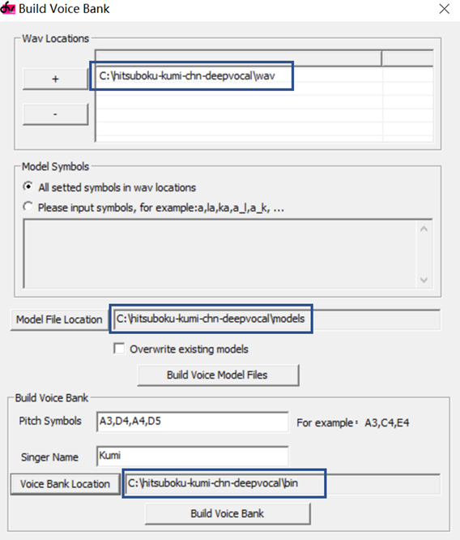

# hitsuboku-kumi-chn-deepvocal
**English** | [中文](README_zh.md)

Hitsuboku Kumi (筆墨クミ) is a UTAU virtual singer developed by Cubialpha. This project ports Hitsuboku Kumi Chinese CVVC voicebank to deepvocal. This is the first open-source deepvocal voicebank on Github.

According to Hitsuboku Kumi's [Terms of use](https://cubialpha.wixsite.com/koomstar/character), redistribution of voicebanks, editing of oto.ini and audio samples, and porting to other synthesis softwares are allowed without permission, so long as the name "Hitsuboku Kumi" is unchanged, "Cubialpha" is credited, a link to [this website](https://cubialpha.wixsite.com/koomstar) is included, and it is clearly stated that you have made edits.

## Download
Download voicebank from [release page](https://github.com/oxygen-dioxide/hitsuboku-kumi-chn-deepvocal/releases/latest)

## Tech Specs
- 4-pitch (A3, D4, A4, D5)
- using Voicemith Reclist
- tail symbol: R
- Deepvocal Toolbox 2.1.0

## Changes to the audio samples
- The volume is Normalized to -9db

## How to build this
1. Download this project with the following command:
```
git clone https://github.com/oxygen-dioxide/hitsuboku-kumi-chn-deepvocal
```

2. Download and install [deepvocal toolbox](https://dl.deep-vocal.com/toolbox/Setup_DeepVocalToolBox_beta_2.1.0.zip)

3. Open kumi.dvtb with deepvocal toolbox. Click"Function→Build voice bank", set "wav locations", "model file location" and "voice bank location" to your download path

For example, if you downloaded this repo to C:\hitsuboku-kumi-chn-deepvocal, then you have to set paths like this:


4. Click "Build Voice Model Files" to compile this voicebank.

5. Click "Build Voice Bank" to pack this voicebank.

## Links
[Deepvocal Official Site](deep-vocal.com)

[Deepvocal toolbox manual](https://drive.google.com/drive/folders/1kAlPZnSO9f4pv5wbVJUdNNQXZQOy6pGA?usp=sharing)

[Hitsuboku Kumi Official Site](https://cubialpha.wixsite.com/koomstar)